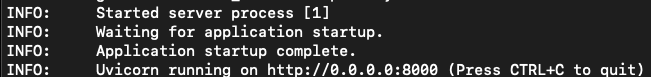

<h1 align="center" style="border-bottom: none;">Educational LLM: Question Generation and Summarization App</h1>

## **Overview**

This is a **Retrieval-Augmented Generation (RAG)** application built with **FastAPI**. The app processes PDFs, creates a searchable vector store, and provides endpoints for generating topic-based questions and summaries using **LangChain**, **FAISS**, and **Groq** models.

---
## **Prerequisites**
* **Docker**: Refer to [Docker's documentation](https://docs.docker.com/engine/install/) to install Docker Desktop.
* **VSCode** (Optional): For local development and testing, download and install [VSCode](https://code.visualstudio.com/). 

## **Features**
- **PDF Ingestion**: Upload and process PDF documents to create vector embeddings for efficient search and retrieval.
- **Question Generation**: Generate Multiple Choice Questions (MCQs) and fill-in-the-blank questions based on a specific topic from the ingested PDF.
- **Summary Generation**: Generate concise, topic-based summaries using retrieved content.
- **Modular Design**: Built with clean and extensible architecture for agent-based applications.

---

## **Technologies Used**
- **FastAPI**: Backend framework for building RESTful APIs.
- **LangChain**: Core library for prompt engineering and chaining LLMs.
- **FAISS**: Efficient vector search and similarity engine.
- **Groq**: LLMs for content generation.
- **Hugging Face Transformers**: For embedding text data.
- **Docker**: Containerization for easy deployment.

---

## **Endpoints**

### **1. `/ingest`**
- **Description**: Uploads and processes a PDF file to create a vector store.
- **Input**:
  - `file` (PDF file)
- **Output**: A success message after processing the PDF.

---

### **2. `/generate/questions`**
- **Description**: Generates questions based on a given topic.
- **Input**:
  - `topic` (string): The topic to focus the questions on.
  - `num_questions` (integer): Number of questions to generate.
- **Output**: A set of MCQs and fill-in-the-blank questions.

---

### **3. `/generate/summary`**
- **Description**: Generates a concise summary for a given topic.
- **Input**:
  - `topic` (string): The topic to summarize.
- **Output**: A well-structured summary.

---

## **Getting Started**


1. **Start Docker Desktop**: Ensure Docker Desktop/Docker daemon is running before proceeding.
2. **Navigate to the App Directory**: Open a terminal and change to the app folder:
   ```bash
   cd path/to/app
   ```
3. **Build the Docker image**: Build the image using 
    ```bash 
    docker build -t <image-name> .
    ```
    For example, let's say image-name is rayen-rag-app:
    ```bash 
    docker build -t rayen-rag-app .
    ```
4. Run the Docker Container: Start the container with:
    ```bash 
    docker run -e GROQ_API_KEY=<groq_api_key> -p 8000:8000 rayen-rag-app
    ```
    *Replace `<groq_api_key>` with your Groq API key. Get your key from the [Groq Cloud API](https://console.groq.com/keys).*

5. **Verify the Server**: Once running, the server will display:
    

6. Usage: Interact with the app using the following `curl` commands:

    * **Ingest PDF**: 
    ```bash
    curl -X 'POST' 'http://localhost:8000/ingest' -H 'accept: application/json' -F 'file=@AQuickAlgebraReview.pdf'
    ```
    * **Generate Questions**: 
    ```bash
    curl -X 'POST' 'http://localhost:8000/generate/questions' -H 'accept: application/json' -F 'topic="<insert_topic>"' -F 'num_questions=<insert_number_questions>'
    ```
    * **Generate Summary**: 
    ```bash
    curl -i -X 'POST' 'http://127.0.0.1:8000/generate/summary' -H 'accept: application/json' -F 'topic=<insert_topic>'
    ```
    *Replace `<insert_topic>` with a topic like "simplifying expressions" or "linear equations", and `<insert_number_questions>` with the desired number of questions.*

---
## **Testing**

I followed a test-driven development approach by creating initial unit tests. However, additional unit tests are still required to capture potential edge cases and further ensure robustness.

To run the unit tests, execute the following command:

```bash
docker exec <container-name> pytest /app/tests/
```

### **Local Development**

For local development, I developed using VSCode within a devcontainer. To set up the environment, follow the steps below:

1. **Start Docker Desktop**:  
   Ensure that Docker Desktop is running before proceeding.

2. **Open the Project**:  
   Open the project in VSCode and reopen it inside the devcontainer.  
   For detailed setup instructions, refer to the [devcontainer guide](docs/devcontainer.md).

3. **Install Dependencies**:  
   Run the following commands in the terminal to install project dependencies using Poetry:
   ```bash
   poetry lock
    ```
   ```bash
   poetry install
    ```
4. **Set up API keys**: In the `.env` file, add API keys. For example: `GROQ_API_KEY=XXXXXXXXXX`.

